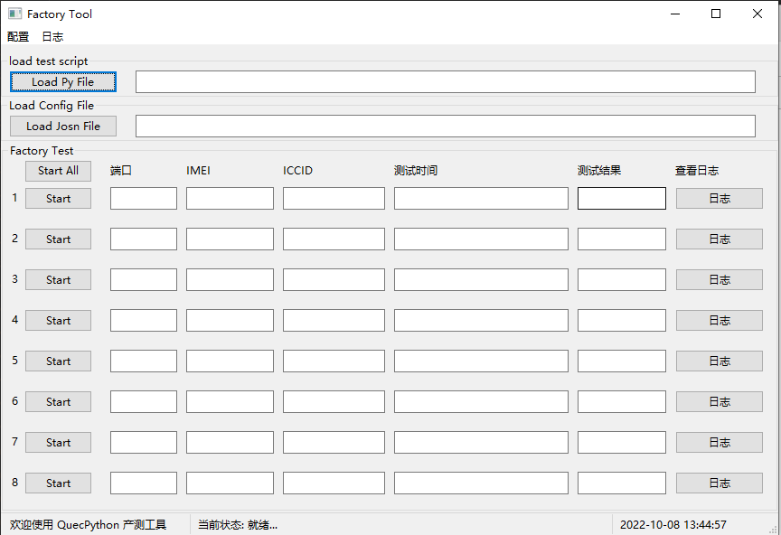
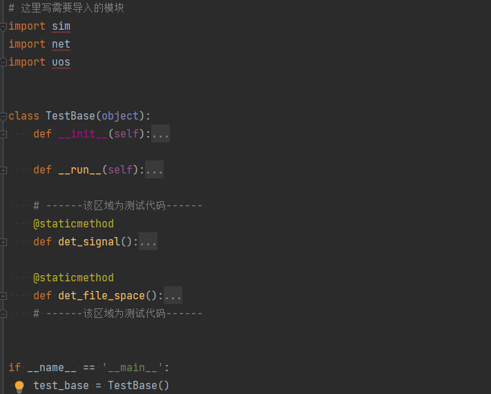

# QuecPython产测工具使用指导手册

## 文档历史

| 版本 | 日期       | 作者 | 变更描述     |
| ---- | ---------- | ---- | ------------ |
| 1.0  | 2022-10-08 | 袁帅 | 初版         |
| 2.0  | 2023-04-23 | 袁帅 | 更新使用说明 |

## 简介

QuecPython产测工具是专用于QuecPython项目模块出厂测试的工具，方便对出厂前已经烧录正式固件的模块进行相关的功能测试，本文档主要介绍如何使用该工具，在电脑使用以下任一种操作系统时，该工具可直接使用

- **Windows7**
- **Windows10**
- **Windows11**

适用模块：

所有使用QuecPython开发的模块均可使用

## 如何拉取仓库

```shell
git clone --recurse-submodules https://github.com/QuecPython/FactoryTool.git
```

## 页面介绍

**菜单栏** 包括配置菜单和日志菜单

**配置菜单** 用于配置自动检测串口以及测试脚本和测试结果文件

**日志菜单** 用于查看测试日志文件和工具运行日志文件	

**加载栏** 包括 加载测试文件和配置文件，其中测试文件为要测试的测试文件，配置文件为测试完成之后要写入到模块的配置文件

**测试区域** 包括 端口、IMEI、ICCID、测试时间、测试结果和测试日志，其中测试日志按钮可以查看测试脚本执行的日志结果，工具有八个测试栏位最多可一次性同时测试八个设备，也可以单独测试某个设备。

**状态栏** 包括欢迎标语和状态信息以及时间信息，其中状态信息会伴随工具运行状态进行切换，时间信息会跟随系统时间变化

> **注意：测试的模块需要保证交互口不处于堵塞状态，否则测试将失败**



## 测试脚本

测试脚本编写时需要注意不得改动原有模板代码结构，建议编写完之后先在模块中手动运行测试，确认运行结果是否满足预期，测试脚本模板中需要改动的位置有两个

**导入模块**：导入测试中用到的python库

**测试函数**：自行编写测试函数，函数名可以自定义，但是需要是静态方法且无法传参，函数体内容根据测试需求自定义，函数需要有返回值，可以是bool或者其他类型（其他类型不会校验测试结果），返回值会在日志中体现，当测试结果不满足预期，需要将测试结果设置为失败时，只需返回布尔值False即可，测试函数案例如下：

```python
# 检测sim卡状态正常并且驻网状态为LTE时测试成功，否则返回失败测试结果
@staticmethod
def det_signal():
	if sim.getStatus() == 1:
		if net.getConfig()[0] == 5:
			return True
     else:
     	return False
```

测试脚本示例：



## 测试原理

产测工具利用python脚本的形式来测试QuecPython产品的业务功能，通过CDC口来执行测试脚本，测试脚本根据测试需求可以自行调整以达成完成生产测试的功能

1. 通过QuecPython的API接口来获取模组参数和运行状态
2. 通过访问正在运行的业务代码中的对象来获取业务运行情况
3. 通过调用业务代码提供的接口才测试业务功能或者硬件功能
4. 通过QuecPython API接口传输配置文件或者写入产品参数

## 测试步骤

**步骤一**：编辑测试**module_test.py**代码，测试代码案例如上图所示

**步骤二**：打开 **Factory Tool**，点击 **Load Py File** 按钮，选择上一步编辑好的测试代码

**步骤三**：如果测试完有需要写入到模块中的配置文件，点击 **Load Json File **选择要写入的配置文件，将会在测试成功之后将该配置文件写入模块

**步骤四**：点击 **Start All** 按钮开始测试所有已接入的模块，也可以通过单独点击端口对应列的 **Start** 按钮来测试某一个模块,测试超时时间2min

**步骤五**：测试完成后可在测试结果栏位看到测试结果，如果测试结果失败，可点击对应失败的那一列的日志按钮来查看测试日志，从而可定位到具体哪一项测试失败

**步骤六**：测试完成后会在工具同级目录下生成**Test-Result.xlsx**文件，包含测试项目内容以及测试结果日志

## 测试结果

每一个模块的的测试结果会写入到excel中导出，可以通过菜单栏的 **配置** 中的 **测试结果文件 **菜单打开该excel文件

每一次测试会在excel中生成一条测试记录（无论测试成功或者失败），多次测试会有多条记录，根据测试设备的IMEI区分

该文件会保存在工具同级目录下，测试过程中自动追加

同时测试结果会上传到云端生成报表以供云端查看整体测试结果（开发中）


## 环境配置

**安装依赖库**

```shell
pip install -r requirements.txt -i https://pypi.tuna.tsinghua.edu.cn/simple
# 如果上面方式安装失败，可以使用单独安装的形式
pip install wxpython -i https://pypi.tuna.tsinghua.edu.cn/simple
pip install pypubsub -i https://pypi.tuna.tsinghua.edu.cn/simple
```
**运行代码**

```shell
python main.py
```
**编译成可执行程序**

```shell
# 如果上面使用单独安装的形式，需要安装一下pyinstaller库
pip install pyinstaller -i https://pypi.tuna.tsinghua.edu.cn/simple
# 编译成exe程序，输出exe目录在./dist/下
pyinstaller -F-w --win-private-assemblies --icon images/quectel.ico -w ./main.py
```
