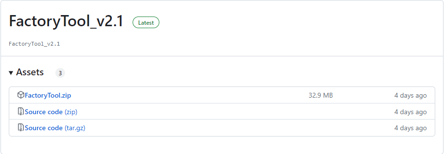
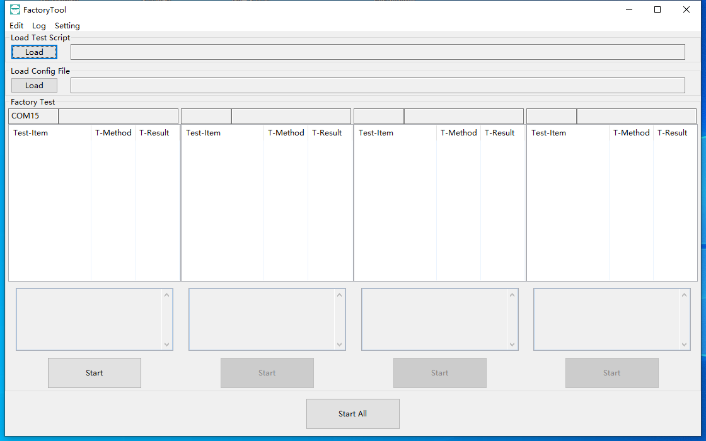
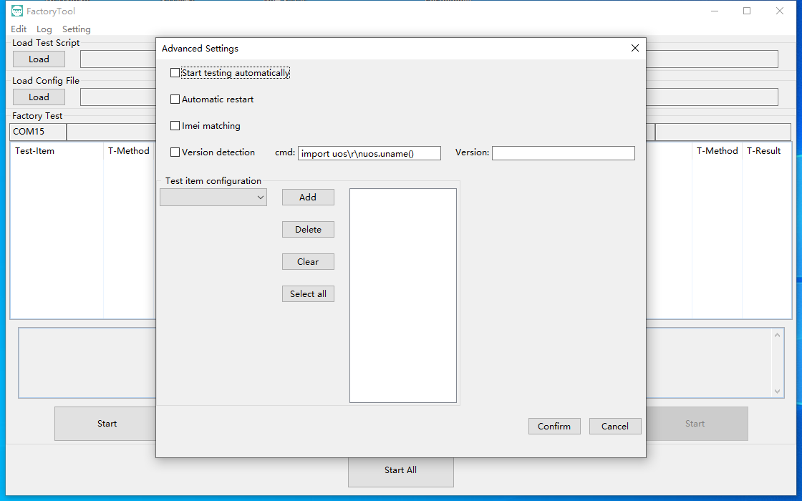
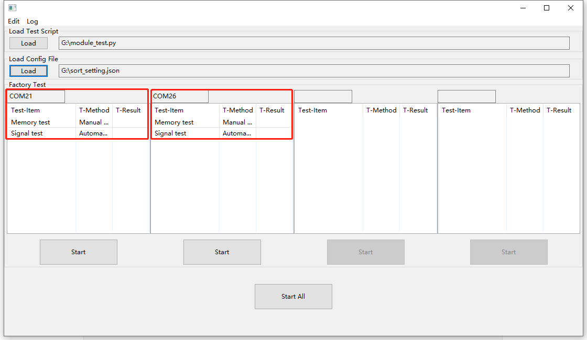
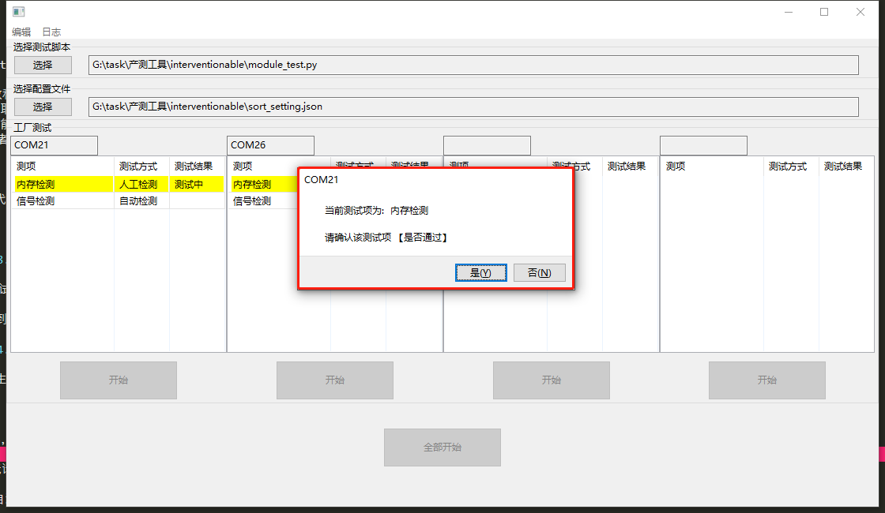
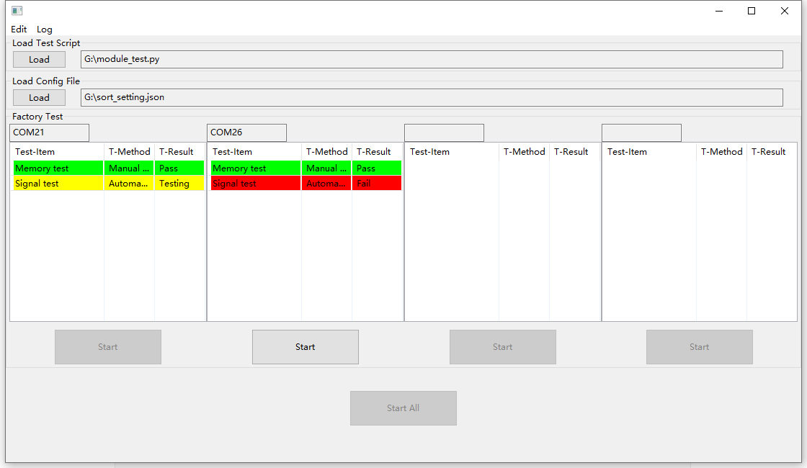

# QuecPython 产测工具应用指导

## 概述

QuecPython 产测工具（下称产测工具）用于对基于 QuecPython 开发的产品进行生产测试。该工具适用于 Windows 7 及以上版本操作系统。

产测工具的基础功能如下：

1. 加载测试脚本和配置文件

    a. 要求用户以单元测试函数为单位编写可运行在产品中的测试脚本。

    b. 用户可在配置文件中为每一项测试绑定测试信息，包括测试项名称、 测试函数名称、测试方式等。

2. 支持自动和人工两种测试方式

    a. 自动测试方式无需人工干预，按照配置文件中的顺序自动测试，并自动保存测试结果，直接遇到人工测试项。

    b. 人工测试在当前项测试结束时，会弹出窗口，以便测试人员手动确认测试结果；工具会保存手动确认的结果。

3. 支持测试明细展示和测试报告查看

    a. 主界面上会以不同的颜色展示每一项的测试结果。

    b. 完整的测试报告将会保存在工具的根目录，以便整体查看。

4. 支持 1 拖 4 测试。

## 工具获取

[点此进入下载页面](https://github.com/QuecPython/FactoryTool/releases)获取产测工具 `FactoryTool.zip`。



## 页面介绍

- **菜单栏**：包括编辑菜单和日志菜单

    - **编辑菜单**：用于编辑测试脚本和Excel日志文件。

    - **日志菜单** 用于查看测试日志文件和工具运行日志文件。

    - **设置菜单** 用于一些高级设置。

- **加载区域**：包括加载测试脚本和配置文件
    - **测试脚本**：测试函数的集合
    - **配置文件**：为每一项测试绑定测试信息，包括测试项名称、 测试函数名称、测试方式等。

- **测试区域**：包括设备连接端口、测试项名称、测试的方式、测试结果，工具有四个测试区域，最多可一次性同时测试四个设备，也可以单独测试某个设备。

> **测试的模块需要保证交互口不处于堵塞状态，否则测试将失败**。



## 设置菜单 - 高级设置


高级设置项修改后，需点右下角 **确认** 才可生效

1. 自动开始测试

    勾选后，检测到交互口自行开始测试

2. 自动重启

    勾选后，测完模组自动重启

3. Imei号匹配

    勾选后会把Imei号和本地工具目录下 **imei.txt** 里的imei号匹配，若存在则通过，否则该项测试不通过。

4. 版本号检测

    勾选后会把软件的版本号(软件版本号获取方式可自行配置，默认用 **uos.uname()** 去获取)和配置的版本号进行匹配，若匹配上测该项测试通过，否则该项测试不通过。

5. 测项配置

    配置该项前需先选择json文件，可对json文件内所有测项进行选择，添加到右边的测项才会检测（默认是所有测项都会测试）

## 测试脚本

测试脚本编写时需要注意不得改动原有模板代码结构，建议编写完之后先在模块中手动运行测试，确认运行结果是否满足预期，测试脚本模板中需要改动的位置有两个

**导入模块**：导入测试中用到的python库

**测试函数**：自行编写测试函数，函数名可以自定义，但是需要是**静态方法**且无法传参，函数体内容根据测试需求自定义，函数需要有返回值，**必须是bool值**

测试脚本示例：

```python
# Write the modules that need to be imported here
import sim
import net
import uos
import utime

class TestBase(object):
    # ------This area is for testing code------
    @staticmethod
    def det_signal(args):
        utime.sleep(2)
        if sim.getStatus() == 1:
            if net.getConfig()[0] == 5:
                return True
            else:
                return False
        else:
            return False

    @staticmethod
    def det_file_space():
        utime.sleep(2)
        if uos.statvfs('usr')[3] > 5:
            return True
        else:
            return False
    # ------This area is for testing code------
```

## 配置文件
配置文件为json文件，需要配置三维数据，分别为: 测试项名称， 测试函数的名称， 测试方式（1为人工测试 0为自动测试）

测试脚本示例：

```json
{
     //        测项名称      测项的function  延时时间  测试方式:0/1/2
    "info": [["Memory test", "det_file_space()", 0, 0],
             ["Signal test", "det_signal('test')", 0, 0]],
    // 测试方式 0: 全自动测试
    // 测试方式 1: 需手动确认开始 和 手动确认结果测试项 - 确认开始的弹窗提示tips内容
    // 测试方式 2: 需手动确认开始 和 自动确认结果测试项 - 确认开始的弹窗提示tips内容

    //       测项名称        该测项对应的提示信息
    "tips": {"Memory test": "Please press button 1"}
}
```

若有配置tips，则在测试该项时，界面测项显示下面的文本框会显示该提示信息

## 测试原理

产测工具利用python脚本的形式来测试QuecPython产品的业务功能，通过 QuecPython 的命令交互口 REPL 来执行测试脚本，测试脚本根据测试需求可以自行调整以达成完成生产测试的功能。

1. 通过QuecPython的API接口来获取模组参数和运行状态。
2. 通过访问正在运行的业务代码中的对象来获取业务运行情况。
3. 通过调用业务代码提供的接口来测试业务功能或者硬件功能。
4. 通过QuecPython API接口传输配置文件或者写入产品参数。

## 测试步骤

**步骤一**：编辑测试脚本和配置文件

编辑测试**module_test.py**代码 和 配置文件**sort_setting.json**，测试代码和配置文件案例如上图所示。

**步骤二**：打开工具，选择测试脚本和配置文件

打开工具后，点击 **选择** 按钮，分别选择上一步编辑好的测试代码和配置文件，若有检测到串口，则该串口下会显示每一项测试名称以及测试方式。



**步骤三**：开始测试

- 点击 **全部开始** 按钮： 开始测试所有已接入的模块。

- 点击 **开始** 按钮： 开始测试对应的那一个模块。

若是人工检测会弹窗提示是否成功，可人工点击 **是/否** 来确认该项结果。


**步骤四**：查看测试结果

可在测试结果栏位直接看到测试结果：
1. 通过： 绿色背景色，测试结果栏位标记： 通过。
2. 不通过： 红色背景色，测试结果栏位标记： 不通过 。
3. 测试中： 黄色背景色，表示该测试项正在检测中。



**步骤五**：查看测试日志

在工具同级目录下生成**Test-Result.xlsx**文件，包含测试项目内容以及测试结果日志。

## 测试结果

每一个模块的的测试结果会写入到excel中导出，可以通过菜单栏的 **编辑** 中的 **编辑Excel文件**菜单打开该excel文件

每一次测试会在excel中生成一条测试记录（无论测试成功或者失败），多次测试会有多条记录，根据测试设备的COM口区分

该文件会保存在工具同级目录下，测试过程中自动追加

## 产测工具二次开发

### 如何拉取仓库

若有二次开发需求，可直接拉取代码仓库。

```shell
git clone --recurse-submodules https://github.com/QuecPython/FactoryTool.git -b interventionable
```

### 环境配置

**安装依赖库**

```shell
pip install -r requirements.txt -i https://pypi.tuna.tsinghua.edu.cn/simple
# 如果上面方式安装失败，可以使用单独安装的形式
pip install wxpython -i https://pypi.tuna.tsinghua.edu.cn/simple
pip install pypubsub -i https://pypi.tuna.tsinghua.edu.cn/simple
```
**运行代码**

```shell
python main.py
```
**编译成可执行程序**

```shell
# 如果上面使用单独安装的形式，需要安装一下pyinstaller库
pip install pyinstaller -i https://pypi.tuna.tsinghua.edu.cn/simple
# 编译成exe程序，输出exe目录在./dist/下
pyinstaller -F -w --win-private-assemblies --icon images/quectel.ico -w ./main.py
```
