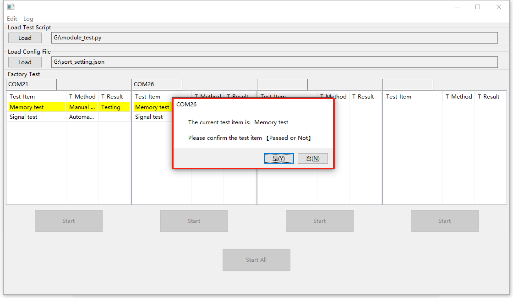

# QuecPython产测工具使用指导手册

## 文档历史

| 版本 | 日期       | 作者 | 变更描述     |
| ---- | ---------- | ---- | ------------ |
| 1.0  | 2023-08-16 | 郭臻 | 初版         |

## 简介

QuecPython产测工具是专用于QuecPython项目模块出厂测试的工具，方便对出厂前已经烧录正式固件的模块进行相关的功能测试，本文档主要介绍如何使用该工具，在电脑使用以下任一种操作系统时，该工具可直接使用

- **Windows7**
- **Windows10**
- **Windows11**

适用模块：

所有使用QuecPython开发的模块均可使用

## 如何拉取仓库

```shell
git clone --recurse-submodules https://github.com/QuecPython/FactoryTool.git -b interventionable
```

## 页面介绍

**菜单栏** 包括编辑菜单和日志菜单

**编辑菜单** 用于编辑测试脚本和Excel日志文件

**日志菜单** 用于查看测试日志文件和工具运行日志文件    

**加载栏** 包括 加载测试文件和配置文件，其中测试文件为要测试的测试文件，配置文件为需要测试function，测试的顺序，测试项的名称，测试的方式(人工测试/自动测试)

**测试区域** 包括 端口、测试项名称、测试的方式、测试结果，工具有四个测试栏位最多可一次性同时测试四个设备，也可以单独测试某个设备。

> **注意：测试的模块需要保证交互口不处于堵塞状态，否则测试将失败**


## 测试脚本

测试脚本编写时需要注意不得改动原有模板代码结构，建议编写完之后先在模块中手动运行测试，确认运行结果是否满足预期，测试脚本模板中需要改动的位置有两个

**导入模块**：导入测试中用到的python库

**测试函数**：自行编写测试函数，函数名可以自定义，但是需要是静态方法且无法传参，函数体内容根据测试需求自定义，函数需要有返回值，可以是bool或者其他类型（其他类型不会校验测试结果），返回值会在日志中体现，当测试结果不满足预期，需要将测试结果设置为失败时，只需返回布尔值False即可，测试函数案例如下：

```python
# 检测sim卡状态正常并且驻网状态为LTE时测试成功，否则返回失败测试结果
@staticmethod
def det_signal():
    if sim.getStatus() == 1:
        if net.getConfig()[0] == 5:
            return True
     else:
        return False
```

测试脚本示例：


## 配置文件
配置文件为json格式
```json
#             测项名称     function      测试方式: 1为人工测试 0为自动测试
{
    "info": [["内存检测", "det_file_space", 1],
             ["信号检测", "det_signal", 0]]
}
```
测试脚本示例：


## 测试原理

产测工具利用python脚本的形式来测试QuecPython产品的业务功能，通过CDC口来执行测试脚本，测试脚本根据测试需求可以自行调整以达成完成生产测试的功能

1. 通过QuecPython的API接口来获取模组参数和运行状态
2. 通过访问正在运行的业务代码中的对象来获取业务运行情况
3. 通过调用业务代码提供的接口才测试业务功能或者硬件功能
4. 通过QuecPython API接口传输配置文件或者写入产品参数

## 测试步骤

**步骤一**：编辑测试**module_test.py**代码 和 配置文件**sort_setting.json**，测试代码和配置文件案例如上图所示

**步骤二**：打开 **Factory Tool**，点击 **选择** 按钮，分别选择上一步编辑好的测试代码和配置文件，若有检测到串口，则该串口下会显示每一项测试名称以及测试方式


**步骤三**：点击 **全部开始** 按钮开始测试所有已接入的模块，也可以通过单独点击端口对应列的 **开始** 按钮来测试某一个模块

若是人工检测会弹窗提示是否成功，可人工点击 **是/否** 来确认该项结果


**步骤四**：测试完成后可在测试结果栏位看到测试结果


**步骤五**：测试完成后会在工具同级目录下生成**Test-Result.xlsx**文件，包含测试项目内容以及测试结果日志

## 测试结果

每一个模块的的测试结果会写入到excel中导出，可以通过菜单栏的 **编辑** 中的 **编辑Excel文件**菜单打开该excel文件

每一次测试会在excel中生成一条测试记录（无论测试成功或者失败），多次测试会有多条记录，根据测试设备的COM口区分

该文件会保存在工具同级目录下，测试过程中自动追加


## 环境配置

**安装依赖库**

```shell
pip install -r requirements.txt -i https://pypi.tuna.tsinghua.edu.cn/simple
# 如果上面方式安装失败，可以使用单独安装的形式
pip install wxpython -i https://pypi.tuna.tsinghua.edu.cn/simple
pip install pypubsub -i https://pypi.tuna.tsinghua.edu.cn/simple
```
**运行代码**

```shell
python main.py
```
**编译成可执行程序**

```shell
# 如果上面使用单独安装的形式，需要安装一下pyinstaller库
pip install pyinstaller -i https://pypi.tuna.tsinghua.edu.cn/simple
# 编译成exe程序，输出exe目录在./dist/下
pyinstaller -F -w --win-private-assemblies --icon images/quectel.ico -w ./main.py
```
